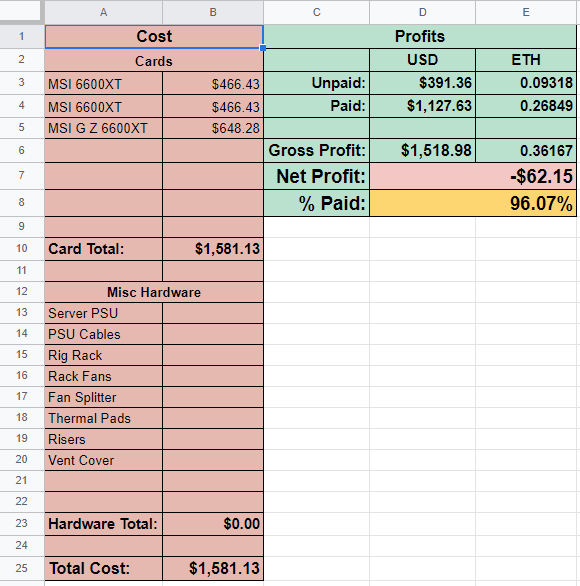

## Description

The premade Google Sheet is used to compare hardware costs with profit and display your % Paid and Net Profit.

Flexpool-GoogleSheets is a Google Sheets script that grabs four pieces of data from Flexpool's API: 
```python
unpaidETH        # Your pending ETH balance that hasn't been paid to your wallet
unpaidCurrency   # unpaidETH converted to your choice of currency
paidETH          # A total of all payments made to your wallet from Flexpool
paidCurrency     # paidETH converted to your choice of currency
```
It then updates specified cells with these values.

## Instructions
You have two options:

- **Option 1** - (Easiest) Make a copy of the premade Google Sheet
  - This lets you use the premade template to calculate your ROI
- **Option 2** - Copy `Code.gs` to your own sheet and modify the cells that get updated.
  - This lets you customize your own Google Sheet and update it with the Flexpool parameters

### Option 1 - Make a copy of the premade Google Sheet

1. [Open the Google Sheet](https://docs.google.com/spreadsheets/d/1FglDMGFwcljRGlY7Z8ZgFRPMwkygtJFVS_IFx3nCuIg/edit?usp=sharing)
2. Click `File` > `Make a copy`
3. With the new sheet open, click `Tools` > `Script editor`
4. Update `lines 3, 4, and 5` with your `address`, `currency` and optionally `soldETH`
5. Save the script
6. Navigate to `Triggers` from the left pane (Looks like a clock icon)
7. Click `+ Add Trigger`
8. Leave all of the defaults and click `Save`

### Option 2 - Use your own sheet

1. Create a new Google Sheet
2. Set up a template that you want to use and note the cells you want to update with `unpaidETH`, `unpaidCurrency`, `paidETH`, `paidCurrency`
3. Click `Tools` > `Script editor`
4. Copy the code from [`Code.gs`](https://github.com/crocokyle/Flexpool-GoogleSheets/blob/main/Code.gs) to your Google Sheet
5. Update `lines 3-5` with your `address`, `currency` and optionally `soldETH`
6. Update `lines 26-29` with the row and column of the cells you want to update
7. Save the script
8. Navigate to `Triggers` from the left pane (Looks like a clock icon)
9. Click `+ Add Trigger`
10. Leave all of the defaults and click `Save`

<hr>
If you have any questions, feel free to add me on Discord: `CrocoKyle#8744`
